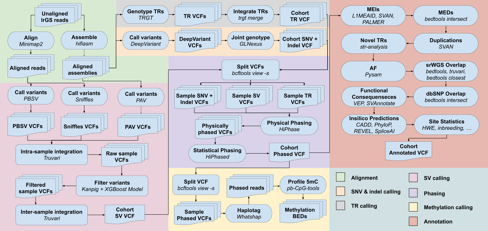

# Pipeline
This document describes how to run the pipeline end-to-end on a new cohort, starting from raw unaligned lrGS reads and finishing with an annotated cohort VCF. It is organized into three steps: preprocessing the cohort-level callsets, phasing them, and annotating them.

Numbered lists are sequential; bulleted lists run in parallel. For the specific sequence of steps used to build the existing HPRC/HGSVC and All of Us callsets, including the ad-hoc reruns and one-off fixes those callsets required, see [Trace](trace.md).

## Inputs
Everything below is cohort-specific and must be supplied per run. Reference files, repeat catalogs, truth sets and Docker images are supplied separately via Terra workspace data - see [References](references.md) and [Docker images](dockers.md).
- **Unaligned lrGS reads** - one unaligned BAM per sample, plus the sample IDs.
- **PED** - six-column pedigree covering every sample, providing sex (`1` male, `2` female) and any family structure. Required by the coverage, post-processing and allele frequency steps.
- **Ancestry** - per-sample genetic similarity group assignments, used for allele frequency annotation.
- **Cohort metadata TSV** - PED and ancestry combined into the single table the TR histograms consume. [CreateCohortMetadata](../wdl/annotation_utils/CreateCohortMetadata.wdl) builds it if you only have the two files separately.
- **Phased truth base VCFs** - haplotype-resolved VCFs covering the cohort's samples, required for backbone phasing in step 2.
- **Sample age data** _(optional)_ - per-sample ages. Supplying this enables age-bin carrier annotation in step 3.

## 1. Preprocessing
Reads are aligned and assembled, three variant callsets (SNV/indel, SV and TR) are generated per sample and integrated across the cohort, and the depth and mobile element files that later steps depend on are built alongside them.

### Alignment and Assembly
Alignment and assembly are independent and run concurrently; only the assembly branch has a second step.
- **[MinimapReadAlignment](../wdl/tools/MinimapReadAlignment.wdl)** - align the raw reads to GRCh38 with Minimap2. Every read-based caller below runs on this BAM.
- Assembly branch:
  1. **[Hifiasm](../wdl/tools/Hifiasm.wdl)** - assemble the reads with hifiasm into two haplotype FASTAs. Without parental or Hi-C data the haplotype assignment is arbitrary rather than maternal and paternal, so the two are interchangeable downstream.
  2. **[MinimapAlignment](../wdl/tools/MinimapAlignment.wdl)** - align the two assembly haplotypes to GRCh38, producing the per-haplotype assembly BAMs that PALMER consumes.

### SNV/Indel Callset
1. **[DeepVariant](../wdl/tools/DeepVariant.wdl)** - call short variants per sample from the aligned reads, emitting a gVCF.
2. **[GLNexus](../wdl/tools/GLNexus.wdl)** - joint-genotype the per-sample gVCFs into a cohort SNV/indel VCF.

### SV Callset
Several callers are run per sample, merged within each sample, merged across the cohort, and then regenotyped to filter.
1. Callers run in parallel:
   - **[PBSV](../wdl/tools/PBSV.wdl)** - read-based calls from the aligned reads.
   - **[Sniffles](../wdl/tools/Sniffles.wdl)** - read-based calls from the aligned reads.
   - **[PAV](../wdl/tools/PAV.wdl)** - assembly-based calls, taking the hifiasm haplotype FASTAs directly rather than the `MinimapAlignment` BAMs.
2. **MergeSampleSVCallsets** ([todo](#todo-workflows)) - intra-sample integration of the per-caller VCFs with Truvari.
3. **MergeCohortSVCallsets** ([todo](#todo-workflows)) - inter-sample integration with Truvari into a cohort SV VCF.
4. **[Kanpig](../wdl/tools/Kanpig.wdl)** - regenotype every site against each sample's reads, requiring non-ref support to retain a call.

### TRGT Callset
1. **[TRGT](../wdl/tools/TRGT.wdl)** - genotype tandem repeat loci per sample from the aligned reads, run once per catalog: TRExplorer v1.0.1 and Vamos v2.1.
2. **[CombineTRs](../wdl/annotation_utils/CombineTRs.wdl)** - deduplicate loci that overlap between the two catalogs into a single per-sample TR VCF.
3. **[AnnotateTREndTags](../wdl/annotation_utils/AnnotateTREndTags.wdl)** - add the `END` INFO field that `trgt merge` requires during phasing.

### Callset Integration
**[PreprocessVcfs](../wdl/annotation_utils/PreprocessVcfs.wdl)** - normalize, harmonize sample IDs, source-tag and length-filter the cohort SNV/indel and SV VCFs, add the core `allele_type` and `allele_length` INFO fields, rename variant IDs, and merge the two into one cohort integrated VCF. The TR VCFs are held back and merged in during phasing.

### Depth Summary
1. **[MosDepth](../wdl/tools/MosDepth.wdl)** - compute per-base coverage per sample, scattered per contig.
2. **[ConcatenateMosDepth](../wdl/annotation_utils/ConcatenateMosDepth.wdl)** - concatenate each sample's per-contig BEDs into one indexed per-base BED.
3. Cohort summaries, in parallel:
   - **[CreateCohortCoverageSummary](../wdl/annotation_utils/CreateCohortCoverageSummary.wdl)** - binned coverage across all samples, for the browser and QC.
   - **[IdentifyLowCoverageRegions](../wdl/annotation_utils/IdentifyLowCoverageRegions.wdl)** - flag recurrently low-coverage bins and derive per-sample coverage cutoffs; both feed the filtering steps in step 3.

### Mobile Element Calls
1. **[PALMERDiploid](../wdl/tools/PALMERDiploid.wdl)** and **[PALMERAssembly](../wdl/tools/PALMERAssembly.wdl)** - call mobile element insertions per sample from the reads and from the assembly BAMs respectively.
2. **[MergePALMERCallsets](../wdl/tools/MergePALMERCallsets.wdl)** - merge the per-sample calls into the cohort PALMER VCF that `AnnotatePALMER` consumes in step 3.

Step 1 ends with a cohort integrated VCF, per-sample TR VCFs, a cohort PALMER VCF, and the depth and coverage-cutoff files.

## 2. Phasing
The cohort integrated VCF is split back per sample and physically phased with HiPhase alongside the TR calls, then those phase blocks are linked into longer haplotypes by transferring phase from the truth base VCFs. TR histograms and methylation profiles are produced from the same outputs.

### Physical Phasing
1. **[ExtractSampleVcfs](../wdl/annotation_utils/ExtractSampleVcfs.wdl)** - split the cohort integrated VCF into per-sample SNV/indel and SV VCFs.
2. **[HiPhase](../wdl/tools/HiPhase.wdl)** - jointly phase each sample's SNV/indel, SV and TR VCFs against its aligned reads, with haplotagging enabled so the haplotagged BAM is available for methylation. Run twice per sample, with and without the TR VCF; the no-TRGT run is needed to recover phase during backbone merging.
3. **[MergeHiPhaseCallsets](../wdl/tools/MergeHiPhaseCallsets.wdl)** - merge the per-sample phased VCFs across the cohort. TR calls are merged separately with `trgt merge`, so this yields both a cohort integrated phased VCF and a cohort TRGT VCF.
4. **[FillPhasedGenotypes](../wdl/annotation_utils/FillPhasedGenotypes.wdl)** - restore the `0/0` genotypes dropped by the per-sample split, pulling them from the pre-phasing cohort integrated VCF. Run on both the TRGT and no-TRGT merges.
5. **[IntegrateTRs](../wdl/annotation_utils/IntegrateTRs.wdl)** - combine the cohort TRGT VCF into the phased cohort VCF, flagging variants that overlap a TR locus.

### Backbone Phasing
Phase is transferred from the input truth base VCFs to link HiPhase phase blocks into longer haplotypes. These workflows operate on one contig at a time, so the VCF is sharded and reassembled around them.
1. **[SplitVcfPerContig](../wdl/annotation_utils/SplitVcfPerContig.wdl)** - shard both the TRGT and no-TRGT phased cohort VCFs per contig.
2. **[BackbonePhase](../wdl/tools/BackbonePhase.wdl)** - transfer phase from the truth base VCFs onto each shard, connecting phase blocks.
3. **[FillBackbonePhasedGenotypes](../wdl/annotation_utils/FillBackbonePhasedGenotypes.wdl)** - fill genotypes still unphased in the TRGT shard from the corresponding no-TRGT shard.
4. **[ConcatenateVcfsAcrossContigs](../wdl/annotation_utils/ConcatenateVcfsAcrossContigs.wdl)** - reassemble the shards into the cohort phased VCF, which is the input to step 3.
5. **[EvaluateBackbonePhasing](../wdl/annotation_utils/EvaluateBackbonePhasing.wdl)** - QC the transferred phase against the base VCFs.

### TR Histograms
1. **[TRGTLPS](../wdl/tools/TRGTLPS.wdl)** - compute the longest polymer sequence (LPS) per TR locus per sample from the cohort TRGT VCF, plus per-contig TRID metadata.
2. **[CreateTRGTHistograms](../wdl/annotation_utils/CreateTRGTHistograms.wdl)** - combine the LPS table, the TRID metadata and the cohort metadata into per-locus stratified histograms for the TR browser.

### Methylation
1. **[MethylationProfiling](../wdl/tools/MethylationProfiling.wdl)** - profile 5mC per sample with pb-CpG-tools from the HiPhase haplotagged BAM, emitting combined and per-haplotype CpG BEDs.
2. **[CreateCohortMethylationFile](../wdl/annotation_utils/CreateCohortMethylationFile.wdl)** - combine the per-sample BEDs into per-contig cohort methylation matrices.

Step 2 ends with the cohort phased VCF, the cohort TRGT VCF and its LPS table and histograms, and the cohort methylation files.

## 3. Annotation
Annotation has two halves. Characterization runs a suite of workflows that read a VCF and emit annotation TSVs without modifying it, so they parallelize freely; only `AnnotateAlleleType` rewrites the VCF mid-way, which is what splits characterization into stages. Integration then folds every TSV back into the VCF and filters it for release.

### Variant Characterization
The VCF advances only at stage 4. Stages 1 to 3 read the cohort phased VCF from step 2; stage 5 reads the allele-type-annotated VCF that stage 4 produces.
1. **[RepeatMasker](../wdl/tools/RepeatMasker.wdl)** - extract insertion sequences from the cohort phased VCF and identify their repeat content, giving the sequence and repeat files the MEI callers need.
2. MEI and duplication callers, in parallel on the cohort phased VCF. These depend on stage 1:
   - **[AnnotateL1MEAID](../wdl/annotation/AnnotateL1MEAID.wdl)** - identify MEIs with L1ME-AID from the RepeatMasker sequences and output.
   - **[AnnotatePALMER](../wdl/annotation/AnnotatePALMER.wdl)** - match the cohort PALMER VCF from step 1 against the callset insertions, using the RepeatMasker output.
   - **[AnnotateSVAN](../wdl/annotation/AnnotateSVAN.wdl)** - identify MEIs, MEDs, tandem duplications, dispersed duplications and NUMTs with SVAN.
   - **[AnnotateMEDs](../wdl/annotation/AnnotateMEDs.wdl)** - identify mobile element deletions by intersecting deletions against the MEI catalog.
3. Independent characterization, in parallel on the cohort phased VCF. These need nothing from stages 1 and 2, so they can start as soon as step 2 finishes:
   - **[AnnotateIndelTRs](../wdl/annotation/AnnotateIndelTRs.wdl)** - flag short indels that represent tandem repeats.
   - **[AnnotateRegion](../wdl/annotation/AnnotateRegion.wdl)** - assign each variant a genomic region class (SR, SD, RM or US).
   - **[AnnotateInSilicoPredictors](../wdl/annotation/AnnotateInSilicoPredictors.wdl)** - look up CADD, Pangolin, PhyloP, REVEL and SpliceAI scores.
   - **[AnnotateGnomADSTR](../wdl/annotation/AnnotateGnomADSTR.wdl)** - match TR calls against the gnomAD V4 STR catalog.
   - **[AnnotateDbSNP](../wdl/annotation/AnnotateDbSNP.wdl)** - assign dbSNP rsIDs to matched SNVs and indels.
   - **[AnnotateVRS](../wdl/annotation/AnnotateVRS.wdl)** - annotate each variant with GA4GH VRS identifiers.
   - **[AnnotateSQMetrics](../wdl/annotation/AnnotateSQMetrics.wdl)** - site-level quality metrics (HWE, inbreeding coefficient, AS fields).
   - **[AnnotateGQMetrics](../wdl/annotation/AnnotateGQMetrics.wdl)** - binned genotype quality and allele balance distributions.
   - **[AnnotateAgeMetrics](../wdl/annotation/AnnotateAgeMetrics.wdl)** - age-bin carrier distributions per variant. Only run when sample age data was supplied.
4. Consolidate the stage 2 evidence and settle `allele_type`, in order:
   1. **[AnnotateMEIs](../wdl/annotation/AnnotateMEIs.wdl)** - compare the L1MEAID, PALMER and SVAN evidence and synthesize one harmonized MEI TSV.
   2. **[SubsetTsvToColumns](../wdl/annotation_utils/SubsetTsvToColumns.wdl)** - extract the duplications of interest from the SVAN output.
   3. **[AnnotateAlleleType](../wdl/annotation_utils/AnnotateAlleleType.wdl)** - rewrite the `allele_type` INFO field from the MED, MEI and duplication TSVs, producing the allele-type-annotated VCF.
5. Functional and overlap annotation, in parallel on the allele-type-annotated VCF. These run after stage 4 because their predictions depend on the final `allele_type`:
   - **[AnnotateVEPHail](../wdl/annotation/AnnotateVEPHail.wdl)** - predict functional effects with VEP via Hail.
   - **[AnnotateSVAnnotate](../wdl/annotation/AnnotateSVAnnotate.wdl)** - predict functional effects for SVs with GATK SVAnnotate.
   - **[AnnotateCallsetOverlap](../wdl/annotation/AnnotateCallsetOverlap.wdl)** - identify gnomAD V4 overlaps via exact, Truvari and bedtools closest matching.
   - **[AnnotateDbVaR](../wdl/annotation/AnnotateDbVaR.wdl)** - match SVs against dbVar records.

### Integration and Release
Each step takes the previous step's VCF, starting from the allele-type-annotated VCF.
1. **[AnnotateVcf](../wdl/annotation_utils/AnnotateVcf.wdl)** - write every annotation TSV from all five characterization stages into the allele-type-annotated VCF as INFO fields.
2. **[PostprocessCallset](../wdl/annotation_utils/PostprocessCallset.wdl)** - transfer the phased genotypes from the step 2 cohort phased VCF, normalize ploidy, prune MEIs, flag homopolymer TRs, drop filters and filter singletons.
3. **[ResolveHaplotypeOverlaps](../wdl/annotation_utils/ResolveHaplotypeOverlaps.wdl)** - resolve calls that overlap on the same haplotype. Runs per contig, so reassemble with `ConcatenateVcfsAcrossContigs`.
4. **[FilterLowCoverageRegions](../wdl/annotation_utils/FilterLowCoverageRegions.wdl)** - filter variants falling in the recurrently low-coverage bins identified in step 1.
5. **[FilterLowCoverageGenotypes](../wdl/annotation_utils/FilterLowCoverageGenotypes.wdl)** - no-call genotypes falling below each sample's coverage cutoff from step 1.
6. **[AnnotateAF](https://github.com/broadinstitute/gatk-sv/blob/kj_project_gnomad_lr/wdl/AnnotateAF.wdl)** - annotate allele frequencies from the cohort ancestry and PED files and the TRGT LPS TSV. Runs last so that the frequencies reflect the filtered genotypes.
7. **[StripGenotypes](../wdl/annotation_utils/StripGenotypes.wdl)** _(optional)_ - drop genotypes to produce a sites-only VCF alongside the full release.

Step 3 ends with the annotated, filtered, allele-frequency-annotated cohort VCF for release.

## TODO Workflows
These steps are part of the end-to-end path but have no workflow in this repository yet. Each needs to be implemented and registered in [`.dockstore.yml`](../.dockstore.yml) before a new cohort can be run from raw reads.
- **MergeSampleSVCallsets** - Truvari intra-sample integration. Per-caller VCFs to one raw VCF per sample.
- **MergeCohortSVCallsets** - Truvari inter-sample integration. Per-sample SV VCFs to a cohort SV VCF.
